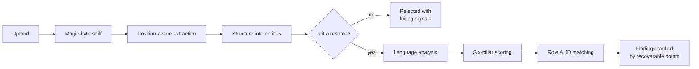

<div align="center">

# ATSense

**Resume intelligence that scores the way a screen actually reads.**

Structure first. Evidence second. Keywords last.

[](https://nextjs.org)
[](https://react.dev)
[](https://www.typescriptlang.org)
[](https://tailwindcss.com)
[](https://threejs.org)
[](tests/engine.test.ts)
[](src/lib/ats/rubric.ts)

</div>

---

## Contents

- [What this is](#what-this-is)
- [Why the score is different](#why-the-score-is-different)
- [Quick start](#quick-start)
- [Scripts](#scripts)
- [The scoring model](#the-scoring-model)
- [How the pipeline works](#how-the-pipeline-works)
- [API reference](#api-reference)
- [Project structure](#project-structure)
- [Engineering decisions](#engineering-decisions)
- [Testing](#testing)
- [Security posture](#security-posture)
- [Troubleshooting](#troubleshooting)
- [Limitations](#limitations)

---

## What this is

An applicant tracking system does not read your resume. It converts it into a **database
record**, and recruiters then search that record. ATSense rebuilds that record the way a
parser does — glyph positions, reading order, section buckets, date fields — and then scores
it, with every point traced back to the line that caused it.

It replaces the single-file Flask prototype in the parent directory, which scored by
substring lookup against a static rulebook.

| | Prototype (v1) | ATSense (v2) |
|---|---|---|
| **Extraction** | `PyPDF2` page concatenation | Position-aware, reading order rebuilt from glyph baselines |
| **Structure** | None — raw text | Contact, roles, dates, education, skills, projects as typed entities |
| **Scoring** | 7 additive buckets, substring matches | 6 weighted pillars, ~45 evidence-linked checks |
| **Keywords** | Flat list, hard-coded divisor | ~150-entity taxonomy with alias expansion |
| **Language** | 5 hard-coded typos | Hunspell + curated map + grammar, tense, casing, clichés |
| **Job matching** | — | Three-state coverage, stuffing detection, tailoring plan |
| **Reproducible** | Yes, but arbitrary | Yes, and versioned + auditable |

---

## Why the score is different

Most checkers tally keywords and call it a score. That is how a resume reads 92 on one tool
and still gets rejected without a screen.

ATSense puts **46% of the total** on the two things that actually decide the outcome —
whether the document parses, and whether the claims are evidenced — and treats an
unsupported keyword list as a *liability* rather than as coverage.

```
Impact & content quality   ██████████████████████████  26%
Parseability               ████████████████████        20%
Skills & keyword coverage  ██████████████████          18%
Structure & consistency    ██████████████              14%
Role & level alignment     ████████████                12%
Language & hygiene         ██████████                  10%
```

> The full rubric — every check, threshold and level expectation — is published at
> **`/scoring`** in the running app and defined in [`src/lib/ats/rubric.ts`](src/lib/ats/rubric.ts).

---

## Quick start

**Requirements:** Node.js 20.9+ (developed on 24.x), npm 10+.

```powershell
npm install
npm run dev
```

Open **http://localhost:3000**.

<details>
<summary><b>Install fails with <code>UNABLE_TO_GET_ISSUER_CERT_LOCALLY</code></b></summary>

<br>

Your network intercepts TLS (corporate proxy or AV SSL scanning). npm retries each request
three times before falling back to stale cache, which looks like a hang. Point Node at the
Windows trust store:

```powershell
$env:NODE_OPTIONS = "--use-system-ca"
npm install
```

To persist it across sessions:

```powershell
setx NODE_OPTIONS "--use-system-ca"
```

</details>

---

## Scripts

| Script | What it does |
|---|---|
| `npm run dev` | Development server with Turbopack |
| `npm run build` | Production build |
| `npm start` | Serve the production build |
| `npm run typecheck` | `tsc --noEmit` |
| `npm run lint` | ESLint (Next.js + React Compiler rules) |
| `npm test` | Vitest suite |
| `npm run verify` | **typecheck + lint + test** — the sprint exit gate |

---

## The scoring model

### Pillars

| Pillar | Weight | What it measures |
|---|---:|---|
| **Parseability** | 20% | Text layer, single-column reading order, tables, bullet glyphs, icon fonts, glyph corruption, canonical headings, date extraction |
| **Impact & content quality** | 26% | Quantified-bullet ratio, metric density, strong verbs, responsibility openers, verb variety, bullet length, outcome framing, summary quality |
| **Skills & keyword coverage** | 18% | Skills section, hard-skill count, **evidence ratio**, stuffing, category breadth, role-critical coverage, technology recency |
| **Structure & consistency** | 14% | Section completeness, reverse-chronological order, date-format consistency, bullets per role, length, contact completeness, timeline gaps |
| **Role & level alignment** | 12% | Target title on page, role-critical skills evidenced, seniority signals, skill recency, target-vs-evidenced level fit |
| **Language & hygiene** | 10% | Spelling, grammar, tense consistency, clichés, pronouns, casing, disqualifying personal fields |

### Bands

| Band | Range | Meaning |
|---|---:|---|
| 🟢 **Excellent** | 88–100 | Parses cleanly and reads convincingly |
| 🟢 **Strong** | 75–87 | Will survive automated screening |
| 🟡 **Needs work** | 60–74 | Readable but under-selling you |
| 🔴 **At risk** | 0–59 | Real risk of being filtered before a human sees it |

### Level expectations

Seniority is judged across six dimensions. Each expectation applies from the level shown and
upward, and is reported as `present` / `partial` / `absent` — with the supporting evidence
when present, or an example phrasing when absent.

| Dimension | Expectation | Applies from |
|---|---|---|
| **Scope** | Feature-level delivery, end to end | Entry |
| **Scope** | System or service ownership | Mid |
| **Scope** | Multi-team scope | Senior |
| **Ownership** | Production and on-call ownership | Mid |
| **Ownership** | Design authority — RFCs and design docs | Mid |
| **Ambiguity** | Defining the problem under uncertainty | Senior |
| **Depth** | Non-trivial technical depth — performance, scale, correctness | Mid |
| **Influence** | Mentoring and multiplying others | Senior |
| **Influence** | Standards and process adopted beyond your team | Staff |
| **Impact** | Tied to revenue, cost, retention or another business metric | Mid |

> Level rubrics approximate industry norms across large technology employers. They are not
> any single company's official standard, and the report says so.

---

## How the pipeline works



Each phase emits a **real event** over an NDJSON stream, so the scanning animation reflects
actual server progress rather than a timer.

| Stage | Emitted after |
|---|---|
| `upload` | Request accepted, rate limit passed |
| `extract` | Text and layout signals recovered |
| `structure` | Entities parsed, document validated |
| `language` | Spelling, grammar and style analysed |
| `score` | All deterministic checks run |
| `match` | Role and job-description matching complete |
| `insights` | Findings ranked and response assembled |

---

## API reference

### `POST /api/analyze`

Node runtime. Returns `application/x-ndjson` — one JSON object per line.

**Request** — `multipart/form-data`

| Field | Type | Required | Notes |
|---|---|:---:|---|
| `resume` | File | ✅ | PDF, DOCX or TXT · ≤ 10 MB · type verified by magic bytes |
| `targetRole` | string | — | `software-engineer` · `frontend-engineer` · `backend-engineer` · `fullstack-engineer` · `data-engineer` · `ml-engineer` · `devops-engineer` · `mobile-engineer` · `data-analyst` · `product-manager` |
| `targetLevel` | string | — | `auto` (default) · `intern` · `entry` · `mid` · `senior` · `staff` · `principal` |
| `jobDescription` | string | — | ≥ 200 characters to enable match scoring |

**Response stream**

```jsonc
{"type":"stage","stage":"upload"}
{"type":"stage","stage":"extract"}
{"type":"stage","stage":"structure"}
{"type":"stage","stage":"language"}
{"type":"stage","stage":"score"}
{"type":"stage","stage":"match"}
{"type":"stage","stage":"insights"}
{"type":"result","result":{ /* AnalysisResult */ },"cacheKey":"…","warnings":[]}
```

Failures arrive as a terminal event rather than an HTTP error, so partial progress is preserved:

```jsonc
{"type":"error","code":"NO_TEXT_LAYER","message":"…"}
```

**Error codes**

| Code | Cause |
|---|---|
| `NO_FILE` / `EMPTY_FILE` | Nothing usable was uploaded |
| `FILE_TOO_LARGE` | Over 10 MB |
| `UNSUPPORTED_TYPE` | Contents do not match PDF, DOCX or TXT |
| `LEGACY_DOC` | Legacy `.doc` — many systems reject it too |
| `ENCRYPTED_PDF` | Password protected |
| `PDF_UNREADABLE` | Corrupt or unparseable |
| `TOO_MANY_PAGES` | Over 12 pages |
| `NO_TEXT_LAYER` | Scanned or image-only PDF |
| `NOT_A_RESUME` | Failed document classification; failing signals included |
| `RATE_LIMITED` | 12 scans per hour per client; `Retry-After` header set |
| `ANALYSIS_FAILED` | Unexpected error; returns a support reference only |

> Error responses never contain a file path, stack trace or internal identifier.

**Example**

```powershell
curl.exe -s -X POST http://localhost:3000/api/analyze `
  -F "resume=@resume.pdf" `
  -F "targetRole=backend-engineer" `
  -F "targetLevel=senior"
```

---

## Project structure

```
src/
├─ app/
│  ├─ api/analyze/route.ts      Streaming NDJSON endpoint (Node runtime)
│  ├─ analyze/                  Upload → scan → report workspace
│  ├─ scoring/                  Published rubric and level matrix
│  ├─ how-it-works/             ATS parsing reference
│  ├─ pricing/ privacy/ terms/  Marketing and legal surface
│  ├─ layout.tsx globals.css    Shell, design tokens, motion system
│  └─ robots.ts sitemap.ts      SEO
│
├─ components/
│  ├─ analyze/                  Dropzone · stage-bound scan loader
│  ├─ report/                   Gauge · pillars · findings · language
│  │                            rewrites · level gap · keyword table · parse preview
│  ├─ three/                    GLSL scan scene · capability detection · hero
│  ├─ layout/                   Header · footer · theme toggle
│  └─ ui/                       Button · card · badge · progress
│
├─ lib/
│  ├─ ats/
│  │  ├─ types.ts               Shared contracts
│  │  ├─ rubric.ts              Versioned weights, thresholds, level rubrics
│  │  ├─ taxonomy.ts            ~150 skill entities with alias expansion
│  │  ├─ dictionary.ts          Curated misspellings, confusables, whitelists
│  │  ├─ text-utils.ts          Tokenising, stemming, distance, similarity
│  │  ├─ parser.ts              Sections, contact, roles, dates, skills, level
│  │  ├─ language.ts            Spelling, grammar, tense, casing, clichés
│  │  ├─ scoring.ts             Six pillars, ~45 checks, ranked findings
│  │  ├─ job-match.ts           JD parsing, three-state coverage, tailoring plan
│  │  ├─ rewrite.ts             Grounded bullet rewriting
│  │  ├─ stages.ts              Pipeline stage definitions
│  │  └─ engine.ts              Orchestration, validation, injection defence
│  ├─ extract/                  Magic-byte sniffing · PDF · DOCX
│  └─ server/                   Rate limiting
│
└─ proxy.ts                     Nonce-based CSP and security headers
```

---

## Engineering decisions

<table>
<tr><td width="30%"><b>No model in the score</b></td>
<td>Every pillar is rule-based, so the same file and rubric version always return the same
number. Rewrites are rule-based too, generated from the candidate's own words.</td></tr>

<tr><td><b>Reading order is reconstructed,<br>not assumed</b></td>
<td><a href="src/lib/extract/pdf.ts"><code>extract/pdf.ts</code></a> groups glyphs into lines
by baseline position and measures inter-glyph gutters. That is how a two-column layout is
<i>detected</i> rather than silently accepted as scrambled text.</td></tr>

<tr><td><b>Evidence beats keywords</b></td>
<td>A skill in your list with no supporting bullet scores as <i>unsupported</i>, never as
covered. Stuffing is structurally unable to raise the score.</td></tr>

<tr><td><b>Untrusted text stays untrusted</b></td>
<td>Resume and job-description content is never interpreted as an instruction. Injection
attempts are detected, neutralised, and surfaced as a warning stating the score was
unaffected — which the test suite asserts.</td></tr>

<tr><td><b>Nothing is invented</b></td>
<td>Rewrites never introduce a number, technology, employer or title absent from the source.
Missing metrics become explicit placeholder tokens with a prompt describing what to
measure.</td></tr>

<tr><td><b>The loader does not lie</b></td>
<td>Stage transitions stream from the server as each phase completes. Without WebGL or with
reduced motion, an equivalent DOM scanner runs with identical labels and an ARIA live
region.</td></tr>
</table>

---

## Testing

```powershell
npm test          # single run
npm run test:watch
npm run verify    # typecheck + lint + test
```

The suite in [`tests/engine.test.ts`](tests/engine.test.ts) is the executable form of the
sprint exit gates in [SPRINTS.md](SPRINTS.md):

- ✅ Determinism — same input and rubric version produce an identical score and cache key
- ✅ Pillar contributions sum to the overall score
- ✅ Alias resolution — `k8s` → Kubernetes, `GCP` → Google Cloud Platform
- ✅ Date formats — month-year, numeric, and apostrophe years flagged as risky
- ✅ Real misspellings caught; technical vocabulary never flagged
- ✅ Unevidenced skill lists penalised
- ✅ Three-state job-description coverage
- ✅ Prompt injection changes the score by exactly zero
- ✅ Rewrites introduce no fabricated metrics

---

## Security posture

| Control | Implementation |
|---|---|
| File type validation | Magic bytes — extension and browser MIME type are never trusted |
| Resource limits | 10 MB, 12 pages, encrypted/corrupt rejection |
| Rate limiting | Server-side, per client, 12/hour with `Retry-After` |
| CSP | Nonce-based with `strict-dynamic`, production only ([`proxy.ts`](src/proxy.ts)) |
| Headers | HSTS, `X-Frame-Options: DENY`, `nosniff`, Referrer-Policy, Permissions-Policy, COOP |
| Prompt injection | Detected, neutralised, and reported as having no score effect |
| Error hygiene | No paths, stack traces or internal identifiers in responses |
| Data retention | Guest scans are processed in memory and discarded — nothing written to disk, no resume text logged |

---

## Troubleshooting

| Symptom | Cause & fix |
|---|---|
| `npm install` appears to hang | TLS interception. Set `NODE_OPTIONS=--use-system-ca` — see [Quick start](#quick-start) |
| Port 3000 already in use | `npm run dev -- --port 3001` |
| `NO_TEXT_LAYER` on a valid PDF | It is a scan or image export. Re-export a text-based PDF from the source document |
| Score changed after an edit to `rubric.ts` | Expected. Bump `RUBRIC_VERSION` so historical scores stay comparable |
| Spell checker unavailable | The dictionary is optional; scoring falls back to the curated correction map and still completes |

---

## Limitations

- **English only.**
- **No OCR fallback** — image-only PDFs are rejected with re-export guidance rather than
  silently scored on unreliable text.
- **Guest-only** — accounts, billing, persistence and share links are specified in the PRD
  but not implemented. Guest scanning is fully functional and stores nothing.
- **Level rubrics are an approximation** of industry norms, not any employer's standard.
- **Benchmarks are illustrative** until validated against a labelled corpus of screening
  outcomes.

---

<div align="center">


<sub>Scores are guidance, not a hiring guarantee.</sub>

</div>

